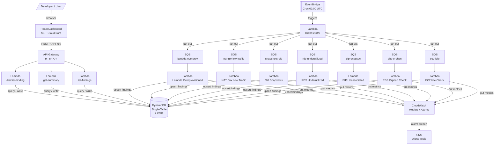
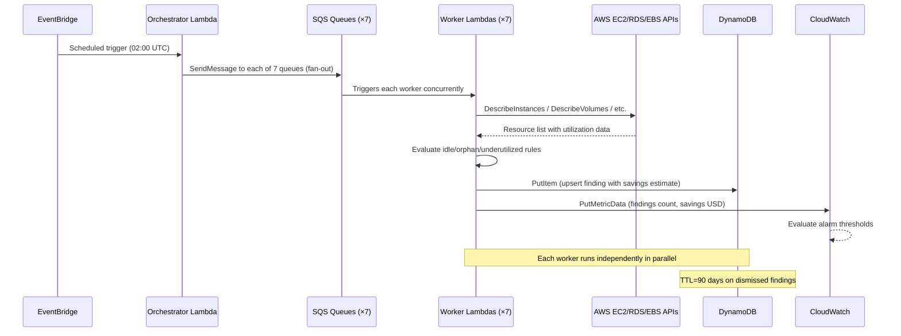
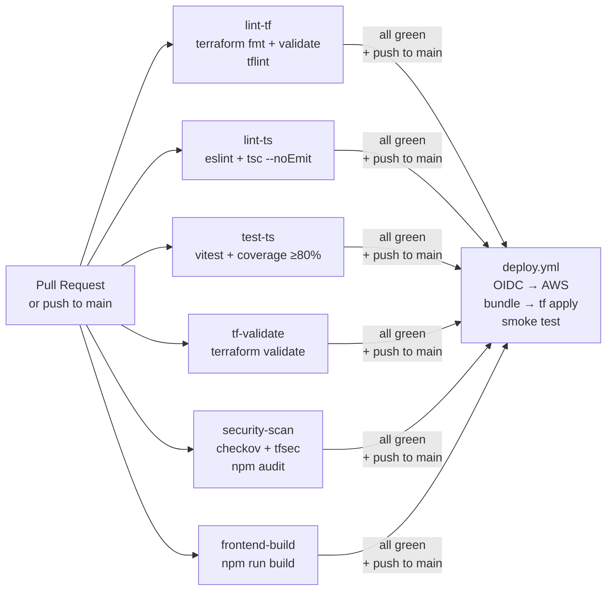

# Architecture

## System Overview

AWS Cost Optimizer is an event-driven serverless system that runs a daily scan across 7 resource categories, stores findings in a DynamoDB single-table, and exposes them through an API and React dashboard. All infrastructure is declared in Terraform with reusable modules.

---

## System Architecture



---

## Daily Scan Sequence



---

## DynamoDB Single-Table Model

```mermaid
erDiagram
    FINDING {
        string pk "ACCOUNT#<accountId>"
        string sk "FINDING#<region>#<checkType>#<resourceId>"
        string gsi1pk "STATUS#active | STATUS#dismissed"
        string gsi1sk "SAVINGS#<zero-padded-cents>"
        string checkType "ec2-idle | ebs-orphan | eip-unassoc | etc."
        string resourceId "AWS resource ID"
        string region "us-east-1 | etc."
        string severity "low | medium | high"
        float monthlySavingsUsd "Estimated monthly savings"
        string status "active | dismissed"
        string metadata "JSON blob with resource details"
        number ttl "Unix timestamp (dismissed only)"
        string createdAt "ISO 8601"
        string updatedAt "ISO 8601"
    }

    GSI1 {
        string pk "gsi1pk — STATUS#<status>"
        string sk "gsi1sk — SAVINGS#<padded> (sort by savings desc)"
    }

    FINDING ||--o{ GSI1 : "projects to"
```

**Access patterns:**
| Pattern | Key |
|---------|-----|
| List all active findings sorted by savings | `GSI1: gsi1pk=STATUS#active`, scan index forward=false |
| Get single finding | `pk=ACCOUNT#<id>`, `sk=FINDING#<region>#<check>#<resource>` |
| Dismiss finding | Update `status`, set `gsi1pk=STATUS#dismissed`, set TTL |
| Summary by check type | Filter expression on `checkType` within GSI1 |

---

## CI/CD Pipeline



- CI jobs run in parallel with a concurrency group (cancels stale runs on new push)
- Deploy uses **OIDC** — no long-lived AWS access keys stored in GitHub Secrets
- Each Lambda handler is bundled independently with esbuild (`--external:@aws-sdk/*`)

---

## AWS Services Reference

| Service | Usage | Reason |
|---------|-------|--------|
| **EventBridge** | Scheduled cron rule | Serverless cron, no EC2 needed, sub-minute precision |
| **Lambda** | Orchestrator + 7 workers + 3 API handlers | Fully managed compute, pay-per-invocation |
| **SQS** | Decoupling between orchestrator and workers | Retry, DLQ, back-pressure, independent scaling |
| **DynamoDB** | Single-table storage for findings | Single-digit ms latency, on-demand billing, TTL |
| **API Gateway** | HTTP API fronting Lambda | Managed auth (API key), throttling, CORS |
| **CloudWatch** | Custom metrics + alarms | Native AWS observability, EMF structured logs |
| **SNS** | Alarm breach notifications | Fan-out to email/Slack/PagerDuty |
| **S3 + CloudFront** | React dashboard hosting | Cheap, globally distributed, HTTPS |
| **SSM Parameter Store** | API key storage | Secrets managed outside code |
| **IAM** | Least-privilege roles per Lambda | Each function has only the permissions it needs |
| **GitHub Actions (OIDC)** | CI/CD without stored credentials | No long-lived keys, role assumed per workflow run |

---

## Architectural Decision Records

See [`docs/adr/`](docs/adr/) for the full rationale behind key design choices:

- [ADR-0001](docs/adr/0001-single-table-dynamodb.md) — Single-table DynamoDB design
- [ADR-0002](docs/adr/0002-worker-lambda-per-check.md) — One Lambda per check type
- [ADR-0003](docs/adr/0003-sqs-between-orchestrator-and-workers.md) — SQS as decoupling layer
- [ADR-0004](docs/adr/0004-api-key-vs-cognito.md) — API key over Cognito for this project
