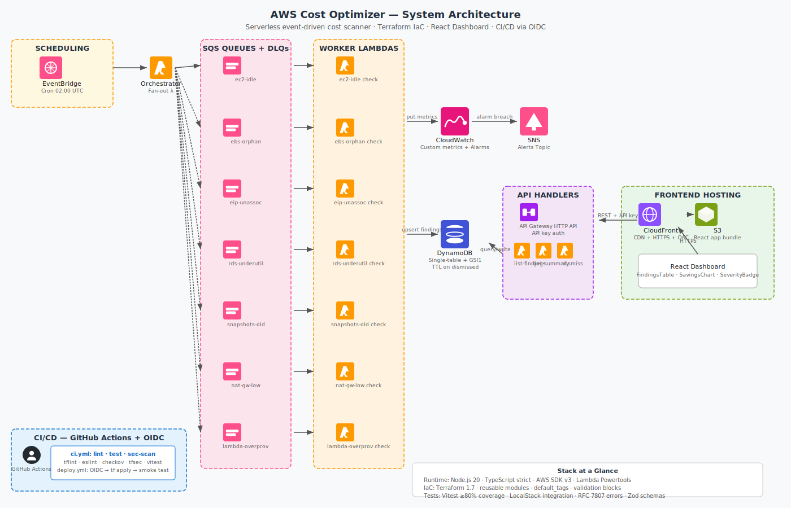

# AWS Cost Optimizer

> **Serverless cost optimization scanner** — detects idle EC2, orphaned EBS, unassociated EIPs, underutilized RDS, old snapshots, low-traffic NAT Gateways, and over-provisioned Lambda functions. Exposes findings via a REST API and a React dashboard with estimated monthly savings.

[](https://github.com/eyrockscript/aws-cost-optimizer/actions/workflows/ci.yml)
[](LICENSE)


---

<video src="docs/demo.mp4" autoplay loop muted playsinline width="100%"></video>

---

## Architecture



*Full architecture documentation with Mermaid diagrams → [ARCHITECTURE.md](ARCHITECTURE.md)*

---

## What This Demonstrates

This project is built as a portfolio piece to demonstrate production-quality practices across the full AWS serverless stack:

- **Event-driven serverless design** — EventBridge cron triggers an orchestrator Lambda that fans out to 7 specialized workers via SQS, with DLQs for retry and fault isolation
- **DynamoDB single-table design** — one table serves all access patterns using composite keys and a GSI sorted by estimated savings, with TTL on dismissed findings
- **Infrastructure as Code (Terraform)** — 7 reusable modules with `validation` blocks, `default_tags`, least-privilege IAM per Lambda, and separate backend config for remote state
- **Strict TypeScript** — `noUncheckedIndexedAccess`, `exactOptionalPropertyTypes`, `noImplicitAny` with full type coverage; Zod schemas at API boundaries
- **CI/CD with OIDC** — GitHub Actions with OpenID Connect instead of long-lived AWS keys; parallel jobs for lint, test, security scan, Terraform validate, and frontend build
- **Security scanning** — checkov + tfsec on all Terraform; npm audit on Node; no hardcoded secrets; API key stored in SSM Parameter Store
- **Observability** — AWS Lambda Powertools structured logging with request correlation IDs; custom CloudWatch metrics in EMF format; alarms with SNS fan-out
- **RFC 7807 error responses** — all API errors return `application/problem+json` with `type`, `title`, `status`, `detail`
- **LocalStack integration** — the full stack runs offline with Docker; no AWS account or real cost needed to develop and test
- **React dashboard** — Vite + TypeScript + Tailwind + recharts; sortable findings table with severity badges and savings breakdown chart; build identifier (commit hash) in footer
- **Architectural Decision Records** — 4 ADRs documenting the key tradeoffs: single-table DynamoDB, one worker per check, SQS decoupling, API key vs Cognito

---

## Quickstart (LocalStack — no AWS account needed)

### Prerequisites

- Docker + Docker Compose
- Node.js 20 (`nvm use`)
- AWS CLI + `awslocal` (`pip install awscli-local`)

```bash
# Start LocalStack, seed AWS resources, and run first scan
make localstack-up

# Open the dashboard
open http://localhost:5173

# Run all tests
make test

# Stop LocalStack
make localstack-down
```

---

## Project Structure

```
aws-cost-optimizer/
├── infra/                      # Terraform IaC
│   ├── modules/
│   │   ├── lambda-function/    # Generic Lambda wrapper with role + DLQ + X-Ray
│   │   ├── dynamodb-findings/  # Single-table + GSI1 + TTL + on-demand billing
│   │   ├── eventbridge-cron/   # Scheduled rule targeting orchestrator
│   │   ├── sqs-with-dlq/       # Queue + DLQ + redrive policy
│   │   ├── api-gateway-http/   # HTTP API + routes + API key via SSM
│   │   ├── frontend-hosting/   # S3 (private) + CloudFront + OAC
│   │   └── github-oidc/        # OIDC provider + role for CI/CD
│   ├── envs/dev.tfvars
│   ├── main.tf
│   ├── providers.tf            # default_tags
│   ├── variables.tf            # with validation blocks
│   └── outputs.tf
├── services/                   # TypeScript Lambda handlers
│   ├── src/
│   │   ├── domain/             # finding.ts · pricing.ts · severity.ts
│   │   ├── infra/              # ddb-client.ts · findings-repo.ts · metrics.ts
│   │   ├── schemas/            # Zod schemas for API input validation
│   │   ├── shared/             # logger.ts · errors.ts · aws-clients.ts
│   │   └── handlers/
│   │       ├── orchestrator.ts
│   │       ├── checks/         # 7 worker handlers
│   │       └── api/            # 3 API handlers
│   └── tests/
│       ├── unit/
│       └── integration/        # LocalStack smoke tests
├── frontend/                   # React + Vite + Tailwind dashboard
│   └── src/
│       ├── api/client.ts
│       ├── components/         # FindingsTable · SavingsChart · SeverityBadge
│       └── pages/              # Dashboard · FindingDetail
├── docs/
│   ├── adr/                    # 4 Architectural Decision Records
│   ├── architecture.svg        # AWS-style architecture diagram
│   ├── architecture.puml       # PlantUML source (renders with aws-icons-for-plantuml)
│   └── cost-model.md           # Pricing reference and savings calculations
├── scripts/
│   └── seed-localstack.sh      # Creates idle EC2, orphaned EBS, unassociated EIPs, etc.
├── .github/
│   ├── workflows/
│   │   ├── ci.yml              # Lint + test + security scan + Terraform validate
│   │   └── deploy.yml          # OIDC → terraform apply → smoke test
│   └── dependabot.yml
├── docker-compose.localstack.yml
├── Makefile
└── ARCHITECTURE.md             # Mermaid diagrams + AWS services reference
```

---

## Deploy to AWS (Real Account)

### Prerequisites

- AWS account with admin access (for initial bootstrap only)
- [Terraform](https://developer.hashicorp.com/terraform/install) ≥ 1.7
- [AWS CLI](https://docs.aws.amazon.com/cli/latest/userguide/install-cliv2.html) configured (`aws configure`)
- [Node.js 20](https://nodejs.org/) + `npm`
- A GitHub repository (for OIDC-based CI/CD)

### Step 1 — Bootstrap Terraform remote state

Terraform needs an S3 bucket and a DynamoDB table to store state before the first apply.
These two resources must be created manually (or via a separate `bootstrap` script):

```bash
# Replace with your preferred region and a globally unique bucket name
REGION=us-east-1
BUCKET=my-org-tf-state-aws-cost-optimizer

aws s3api create-bucket --bucket "$BUCKET" --region "$REGION" \
  --create-bucket-configuration LocationConstraint="$REGION"

aws s3api put-bucket-versioning --bucket "$BUCKET" \
  --versioning-configuration Status=Enabled

aws dynamodb create-table \
  --table-name tf-lock-aws-cost-optimizer \
  --attribute-definitions AttributeName=LockID,AttributeType=S \
  --key-schema AttributeName=LockID,KeyType=HASH \
  --billing-mode PAY_PER_REQUEST \
  --region "$REGION"
```

Update `infra/backend.tf` with the bucket name and region you just created.

### Step 2 — First Terraform apply

```bash
cd infra
terraform init
terraform apply -var-file=envs/dev.tfvars
```

Terraform will output:
- `api_url` — the API Gateway endpoint
- `dashboard_url` — the CloudFront URL for the React app
- `api_key_ssm_path` — SSM path where the generated API key is stored

Retrieve the API key:
```bash
aws ssm get-parameter --name "$(terraform output -raw api_key_ssm_path)" \
  --with-decryption --query Parameter.Value --output text
```

### Step 3 — Configure GitHub secrets

Required in **Settings → Secrets → Actions** of your fork:

| Secret | Value |
|--------|-------|
| `AWS_DEPLOY_ROLE_ARN` | ARN of the OIDC role created by the `github-oidc` Terraform module (`terraform output github_oidc_role_arn`) |
| `API_KEY` | Value retrieved from SSM in Step 2 |

After these are set, every push to `main` triggers the `deploy.yml` workflow:
OIDC auth → bundle Lambdas → `terraform apply` → smoke test → build frontend → S3 sync + CloudFront invalidation.

### IAM permissions required by Lambda workers

The Lambda execution roles (created by Terraform) need the following **read-only** AWS permissions:

| Service | Actions |
|---------|---------|
| EC2 | `ec2:DescribeInstances`, `ec2:DescribeAddresses`, `ec2:DescribeVolumes`, `ec2:DescribeSnapshots` |
| RDS | `rds:DescribeDBInstances` |
| CloudWatch | `cloudwatch:GetMetricStatistics`, `cloudwatch:PutMetricData` |
| Lambda | `lambda:ListFunctions`, `lambda:GetFunctionConfiguration` |
| DynamoDB | `dynamodb:PutItem`, `dynamodb:GetItem`, `dynamodb:UpdateItem`, `dynamodb:Query`, `dynamodb:Scan` |
| SSM | `ssm:GetParameter` (for the API key) |
| SQS | `sqs:SendMessage`, `sqs:ReceiveMessage`, `sqs:DeleteMessage` |

All permissions are least-privilege and scoped to the resources created by the stack.
No admin or write permissions to EC2/RDS/Lambda are granted — the scanner only reads.

### Estimated monthly cost (dev environment, us-east-1)

| Service | Usage assumption | Cost |
|---------|-----------------|------|
| Lambda | 8 functions, once/day, < 30 s each | ~$0.01 |
| DynamoDB | On-demand, < 1 K findings | ~$0.25 |
| SQS | < 1 M requests/month | Free tier |
| API Gateway | < 1 M requests/month | Free tier |
| CloudFront + S3 | < 1 GB transfer | ~$0.02 |
| EventBridge | 1 rule, 30 invocations/month | Free tier |
| CloudWatch Logs | < 5 GB | Free tier |
| **Total** | | **≈ $0.30/month** |

---

## Cost & Cleanup

**Development cost: $0** — all development and testing uses LocalStack community edition. No real AWS resources are created until you explicitly run `make deploy` with valid AWS credentials.

**Estimated production cost (dev environment, us-east-1):**

| Service | Estimated cost |
|---------|----------------|
| Lambda (7 workers + orchestrator, daily) | ~$0.01/month |
| DynamoDB (on-demand, < 1K findings) | ~$0.25/month |
| SQS (< 1M requests/month) | Free tier |
| API Gateway (< 1M requests/month) | Free tier |
| CloudFront + S3 | ~$0.02/month |
| **Total** | **< $0.30/month** |

```bash
# Destroy all AWS resources when done
make destroy
```

---

## Trade-offs & Design Decisions

See [`docs/adr/`](docs/adr/) for the full rationale:

- [ADR-0001](docs/adr/0001-single-table-dynamodb.md) — Why single-table DynamoDB over multiple tables
- [ADR-0002](docs/adr/0002-worker-lambda-per-check.md) — Why one Lambda per check instead of a monolith
- [ADR-0003](docs/adr/0003-sqs-between-orchestrator-and-workers.md) — Why SQS over direct invocation or Step Functions
- [ADR-0004](docs/adr/0004-api-key-vs-cognito.md) — Why API key over Cognito for this project

---

## Contributing

See [CONTRIBUTING.md](CONTRIBUTING.md) for commit conventions, branch strategy, how to run tests, and how to add a new check type.

---

## License

[MIT](LICENSE) — Eliud Trejo, 2026
